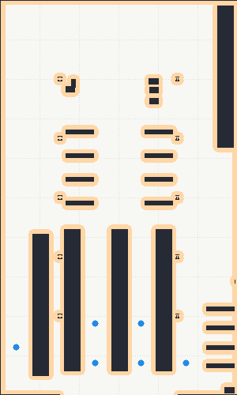
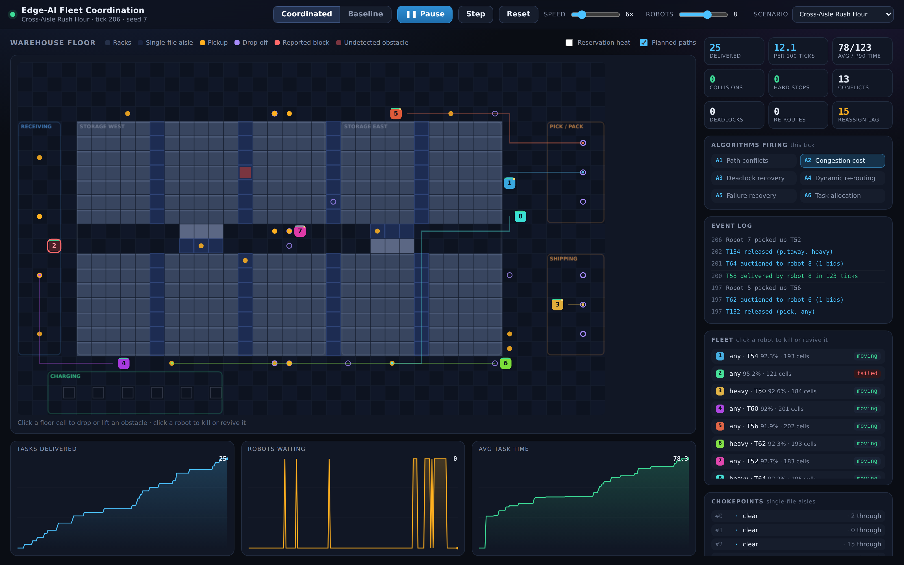

# Edge-AI Based Distributed AMR Fleet Coordination

Decentralised coordination and collision avoidance for a warehouse AMR fleet,
in two halves that answer two different questions.

| | `amrsim/` — the protocol | `ros2_ws/` — the robots |
|---|---|---|
| **Question** | Is the coordination logic correct, and what is it worth? | Do real robots actually drive on it? |
| **World** | 40 × 24 grid, one cell per tick | The MovAi warehouse in Gazebo, 30 × 50 m, continuous |
| **Robots** | Abstract agents | Tugbots with diff-drive, lidar and a battery |
| **Runs on** | Anything with Python 3.10 | ROS 2 + Gazebo, or headless via the twin |
| **Read** | this file | [`ros2_ws/src/warehouse_picker/README.md`](ros2_ws/src/warehouse_picker/README.md) |

Both are pure standard library — no pip install, no framework.

```bash
# the protocol, on the grid
python3 run_dashboard.py          # live dashboard at http://127.0.0.1:8000
python3 run_benchmark.py          # baseline vs coordinated -> results/report.html

# the robots, in the warehouse
python3 tools/build_map.py                        # rebuild the warehouse map
python3 tools/twin.py --compare --robots 6        # fleet vs stop-and-wait, headless
cd ros2_ws && colcon build && source install/setup.bash
ros2 launch warehouse_picker fleet_warehouse.launch.py

python3 -m unittest discover -s tests -t .        # 107 tests, both halves
```

## The warehouse



Rasterised from the MovAi models' own collision geometry — the building mesh
sliced at robot height, plus every rack's collision box — and exported as a
Nav2 map, a pre-inflated planning grid, and this preview. Orange is the 0.55 m
halo a robot centre must stay out of.

The map is honest about what it finds: the 1.85 m aisle between the two western
racks has structural columns standing in it, so 74 cells of the floor are
unreachable and the planner correctly refuses routes into them.

---

## What `amrsim/` is

A grid-world simulation for **demonstrating and measuring the coordination
logic**. It is not a physics model — robots move one cell per tick — and that
is the division of labour: `ros2_ws/` carries the kinematics, the lidar and the
real map, while this half isolates the protocol so it can be stressed at
densities and failure rates a simulator run would take hours to reach. What it
*is* faithful to is the protocol — Lamport-ordered reservations, deterministic n-way conflict
ranking, congestion-aware planning with fairness bounds, wait-graph deadlock
recovery, gossiped block events with a confirm/soften/clear lifecycle,
heartbeat TTL failure detection, and a CRDT task pool with a time-boxed
auction.

The warehouse is deliberately hard: five racks per bank separated by
**single-file picking aisles**, plus two pinch points in the central corridor.
Every interior aisle is a chokepoint two robots cannot share, so contention is
structural rather than incidental.



## How the code maps to the algorithm reference

| Module | Implements | Reference |
|---|---|---|
| `amrsim/reservations.py` | Lamport clock, per-cell occupancy windows, transitive conflict-cluster BFS, `priority DESC / lamport ASC / id ASC` ranking, angle-based geometry classification | Algorithm 1 |
| `amrsim/corridors.py` | Chokepoint / in-transit lock: FIFO fairness at single-file aisles, drive-through commitment | Algorithm 1, component 3 |
| `amrsim/planner.py` | Congestion-aware cost, deterministic per-robot jitter, fairness-adjusted `alpha`, bounded detour cap, windowed space-time A\* | Algorithm 2 (+ 4's cost term) |
| `amrsim/deadlock.py` | Bounded wait-graph chain walk, expanding-radius escape with lane-switch bias, BFS shuffle chain, gridlock alert | Algorithm 3 |
| `amrsim/blocks.py` | `BlockEvent` with confidence/TTL/severity, confirm window, idempotent Lamport-ordered reports, soften-never-delete expiry, reprobe escalation | Algorithm 4 |
| `amrsim/failures.py` | Heartbeat TTL detection, idempotent `declare_failed`, footprint-as-block, task released into the normal pipeline, recovery re-sync | Algorithm 5 |
| `amrsim/tasks.py` | OR-Set CRDT pool with origin-id dedup and conflict-free merge, capability prefilter, time-boxed auction, aging against starvation, leases, exponential requeue backoff | Algorithm 6 |
| `amrsim/engine.py` | Orchestrates all six per tick, in `coordinated` or `baseline` mode | — |
| `amrsim/warehouse.py` | The map, and automatic detection of every single-file corridor | — |
| `amrsim/scenarios.py` | The documented stress cases | — |
| `web/` | Dashboard server + client | — |

## The one architectural decision worth knowing

Conflict resolution is **constructive, not corrective**. Each tick, robots are
ranked with the documented rule and plan in that order; each one runs a
**space-time A\*** whose search nodes are `(cell, tick)` and whose actions are
"move to a neighbour" or "wait here". A path is only returned if it never
occupies a cell at the same tick as a committed reservation and never swaps
places with an oncoming robot.

That single change is why the fleet is collision-free by construction rather
than by negotiation: WAIT, REROUTE and REVERSE all fall out of the search
itself, at the cost the cost function assigns them, instead of being bolted on
after a conflict is detected. The reference's `select_action` decision is
still made — it is just made *inside* the planner, where it can be made
optimally. The reference's `cascades(depth)` recursion bound has no counterpart
for the same reason: each robot plans exactly once per tick, in rank order,
against the reservations already committed, so a reroute cannot set off a chain
of further reroutes.

Only the first `COOP_WINDOW` (16) ticks are searched in space-time; past that
the search collapses to ordinary spatial A\*. Every robot replans each tick and
only ever executes its next step, so the window is exactly the horizon that has
to be exclusive. This is what keeps a plan a few hundred node expansions
instead of a few hundred thousand.

## Results

`python3 run_benchmark.py --trials 8` on the deterministic Rush Hour scenario
(8 robots, 500 ticks, identical task list and faults in both arms, mean over
8 seeds):

| | Coordinated | Baseline | |
|---|---|---|---|
| Tasks delivered | **48.0 / 48** | 45.9 / 48 | coordinated finishes the workload every seed |
| Throughput / 100 ticks | **9.60** | 9.17 | |
| P90 task time | **190** | 199 | tighter tail |
| Average task time | 115 | **114** | see below |
| Unplanned hard stops | **0** | 50 | |
| Failure reassignment latency | **15** | 45 | heartbeat TTL vs. fixed timeout |
| Collisions | **0** | **0** | in every trial, in both modes |
| Fleet distance | 2799 | **2641** | the price of congestion avoidance |

**Reported honestly:** at this density the coordinated fleet's *mean* task time
and total distance are marginally worse. That is not a bug being hidden — it is
what the congestion term costs. Coordinated robots detour around contention
(≈6% more distance) and in exchange never emergency-stop, deliver the whole
workload every seed, and have a tighter tail. Baseline's mean also flatters
itself: in the seeds where it fails to finish, the tasks it drops are the slow
ones, so they never enter its average.

### The result is density dependent, and that is the finding

Mean task time over 6 seeds, same scenario, varying fleet size:

| Robots | Coordinated | Baseline | Delivered (coord / base) | Hard stops (coord / base) |
|---|---|---|---|---|
| 6 | 164.7 | **156.7** | 45.2 / 42.5 | 0 / 31 |
| 8 | 116.5 | **113.6** | 48.0 / 45.2 | 0 / 48 |
| 10 | 81.7 | **81.6** | 48.0 / 46.7 | 0.3 / 70 |
| 12 | **65.5** | 66.3 | 48.0 / 47.0 | 0.2 / 78 |

Coordination costs a little when the floor is quiet relative to the fleet, and
pays for itself as density rises: baseline's hard stops grow from 31 to 78
while coordinated's stay at zero, and by 12 robots that overtakes the detour
cost. Completion rate favours coordination at *every* density. Reproduce the
curve with `run_benchmark.py --robots N`.

### Modelling note: what an unplanned stop costs

`HARD_STOP_RESUME_TICKS = 2` charges a robot two ticks to decelerate and
re-accelerate when something *surprises* it. A planned wait costs nothing
extra, because the robot knew in advance and eased off. That asymmetry is the
practical difference between yielding and being stopped, and the reference's
20 Hz safety node (`HARD_STOP_RADIUS`, `SLOW_ZONE_RADIUS`, speed caps) is
exactly the mechanism that imposes it. Set it to `0` in `amrsim/config.py` to
remove the assumption; the coordinated advantage on hard stops and completion
rate survives, the task-time comparison shifts toward baseline.

## Dashboard

`python3 run_dashboard.py` then open <http://127.0.0.1:8000>
(screenshot above).

* **Coordinated / Baseline** — rebuilds the same scenario under the other mode.
* **Play / Step / Reset**, speed and fleet-size sliders, scenario picker.
* **Click any floor cell** to drop or lift a physical obstacle; robots must
  *detect* it before it appears in the block registry.
* **Click a robot** (on the floor or in the fleet list) to cut its heartbeat,
  or to revive it.
* Live: reservation heat map, planned paths, chokepoint flow direction and
  queues, which of the six algorithms fired this tick, and the event log.
* Keyboard: `space` play/pause, `s` step, `r` reset, `m` switch mode.

## Scenarios

| Name | What it stresses |
|---|---|
| `rush_hour` | The open-ended demo: traffic funnelled through the two busiest single-file aisles, an aisle blocked at t=60, a robot silenced at t=110 |
| `rush_hour_fixed` | The same episode on a closed, fixed task list — the fair benchmark case |
| `chokepoint_duel` | Robots sent into one aisle from opposite ends, repeatedly |
| `failure_storm` | Robots dropping off the network in waves while carrying items |
| `aisle_gridlock` | A robot dies inside a single-file aisle with another right behind it |

## Layout

```
ros2_ws/src/warehouse_picker/    the Gazebo fleet (see its own README)
  warehouse_picker/
    occupancy.py   the map: rasterise, inflate, distance field, ray cast
    navigation.py  A*, pure pursuit, dynamic-window local planner
    protocol.py    the P2P mesh: heartbeats, ranking, yielding, deadlock
    allocation.py  sealed-bid auction with no auctioneer
    agent_core.py  the whole robot brain, with no ROS in it
    stations.py    pick faces derived from the rack geometry
    edge_fleet_agent.py / task_dispatcher.py / fleet_dashboard.py   ROS nodes
  worlds/ launch/ maps/ config/
tools/
  fetch_world_assets.py   derive the layout from the Fuel models
  build_map.py            rasterise it into Nav2 + planning maps
  twin.py                 headless fleet: same agent code, no simulator

amrsim/          simulation package (no dependencies)
  config.py      every tunable, named after the reference's constants
  warehouse.py   map, zones, pick faces, automatic corridor detection
  reservations.py / corridors.py / planner.py / deadlock.py
  blocks.py / failures.py / tasks.py
  robot.py  metrics.py  engine.py  scenarios.py
web/             dashboard server + static client
tests/           107 unit and end-to-end tests across both halves
run_dashboard.py run_benchmark.py
```

## Known limitations

* **Single process, not truly distributed.** The reservation table and task
  pool are shared structures rather than gossiped between processes — the
  correct simplification for a demonstration tool, but it means network
  partition and message loss are not exercised here. The Lamport ordering,
  idempotency and CRDT merge that make the real protocol safe *are*
  implemented, so the code would survive being split; the scenarios just do not
  test it. `ros2_ws/` is the half that does split it: there, each robot is its
  own process with its own replica, exchanging serialised messages over DDS,
  and a peer that goes quiet is detected by heartbeat TTL rather than by
  reading a shared variable.
* **Discrete ticks, one cell per tick.** No acceleration, turning cost, or
  continuous motion beyond the hard-stop penalty described above.
* **Wait-graph cycles are rare by construction.** Because the space-time
  planner cannot commit a head-on path, true deadlock cycles almost never form
  in normal operation, and `deadlock_events` is usually 0. Algorithm 3 is a
  genuine safety net rather than a hot path here; it is exercised directly by
  unit tests and by the `aisle_gridlock` scenario.
* **Battery is cosmetic.** It drains and gates task bidding, but there is no
  charging behaviour. The Gazebo agent does have one: it releases its task and
  drives to the charging station below 22%.

See `GUIDE.md` for a walkthrough, demo script, and how to extend it.
